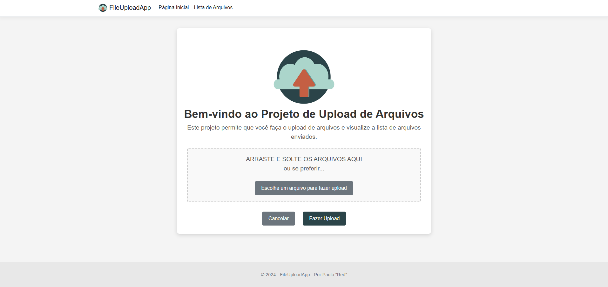

# 📂 FileUploadApp

Bem-vindo ao **FileUploadApp**! Este é um projeto desenvolvido com o objetivo de criar uma aplicação que permite o upload de arquivos, armazena essas informações em uma tabela de banco de dados e exibe os dados para o usuário.



## 🚀 Tecnologias Utilizadas

- **C#**
- **.NET**
- **ASP.NET Core MVC**
- **Entity Framework Core**
- **SQL Server**
- **HTML/CSS/JavaScript**

---

## 📂 Funcionalidades

- **Upload de Arquivos**: Interface para upload de arquivos com suporte a vários tipos de arquivos.
- **Armazenamento de Dados**: Arquivos carregados são armazenados em uma tabela no banco de dados SQL Server.
- **Exibição de Dados**: Interface que exibe os dados dos arquivos carregados, permitindo ao usuário visualizar informações relevantes.

---

## 🛠️ Como Rodar o Projeto

### Pré-requisitos

- [.NET SDK](https://dotnet.microsoft.com/download) (versão 7.0 ou superior)
- [SQL Server](https://www.microsoft.com/en-us/sql-server/sql-server-downloads)
- [Visual Studio](https://visualstudio.microsoft.com/) ou qualquer outro editor de sua preferência.

### Configuração

1. **Clone o Repositório:**

   ```bash
   git clone https://github.com/seu-usuario/FileUploadApp.git
   cd FileUploadApp

2. **Configuração do Banco de Dados:**

- Certifique-se de que o SQL Server está instalado e em execução.
- Atualize a string de conexão no arquivo appsettings.json com suas credenciais de SQL Server.

3. **Migrar o Banco de Dados:**
   ```bash
   dotnet ef database update
4. **Executar a Aplicação:**
   ```bash
   dotnet run
5. **Acessar o Aplicativo:**
- Abra o navegador e vá para http://localhost:5000.

## 📜 Documentação
- Estrutura do Projeto: O projeto é estruturado em várias pastas, incluindo Controllers, Models, Views e Data.
- Controllers: Gerencia a lógica de upload e exibição de arquivos.
- Models: Define a estrutura dos dados dos arquivos.
- Views: Interface do usuário para upload e visualização de arquivos.
- Data: Configuração do Entity Framework e contexto do banco de dados.

## 🛠️ Contribuições
Sinta-se à vontade para contribuir com melhorias, correções ou sugestões! Para contribuir, siga estes passos:

Faça um fork deste repositório.
Crie uma branch para sua modificação (git checkout -b minha-mudanca).
Faça suas alterações e commit (git commit -am 'Adiciona nova funcionalidade').
Envie para o repositório (git push origin minha-mudanca).
Abra um Pull Request.

## 📫 Contato
Se você tiver perguntas ou quiser conversar sobre o projeto, sinta-se à vontade para me contactar através das redes sociais ou do e-mail: pauloalberto13@gmail.com.


